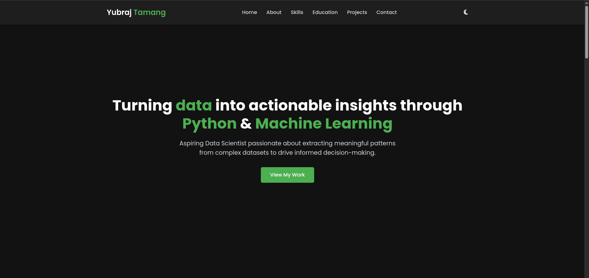
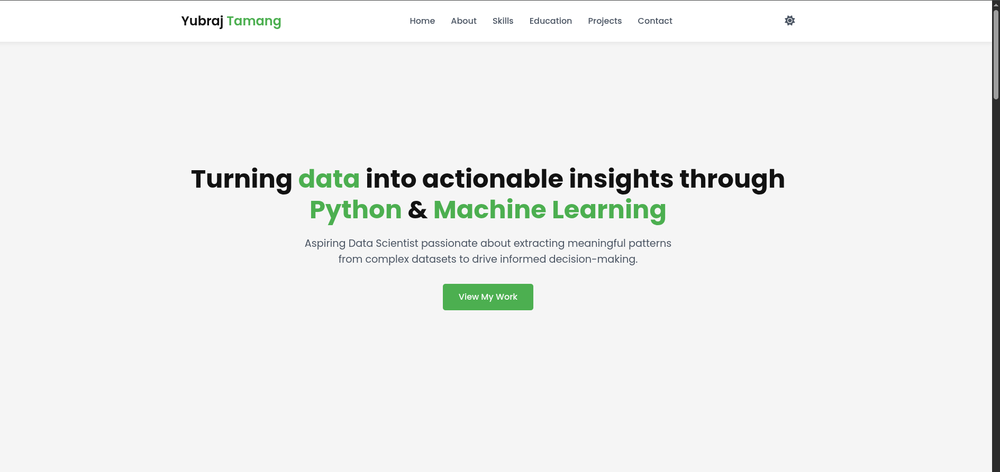

# 🌐 Yubraj Tamang - Portfolio Website

Welcome to the source code for my **personal portfolio website** — a modern, responsive site built using **HTML, CSS, and JavaScript** to showcase my skills, education, and projects as a **Data Scientist**.

---

## 🎯 Project Overview

This website is designed with a **Neo Minimal Tech** aesthetic:
- Dark mode default for a modern tech vibe
- Clean layout, smooth transitions, and hover effects
- Green as the primary accent color (buttons, highlights)
- Fully responsive across desktop, tablet, and mobile

---

## 🧠 Features

- ✅ Responsive design using **Flexbox** and **CSS Grid**
- 🌙 **Dark mode toggle**
- 🎯 Professionally structured layout with:
  - Hero section
  - About Me
  - Skills section (Python, Pandas, ML, etc.)
  - Education history
  - GitHub project demos
  - Contact & social media links
- ✨ Smooth hover animations and transitions
- 📧 Connect via email: `yt60015@gmail.com`

---

## 🛠️ Built With

- HTML5  
- CSS3 (Custom styling with variables & media queries)  
- JavaScript (for dark mode and interactivity)  
- Google Fonts (`Roboto`, `Inter`)  
- Icons (optional: Font Awesome or SVGs)

---

## Feel free to contribute or suggest improvements to this project!

